# Mental Health Awareness Website

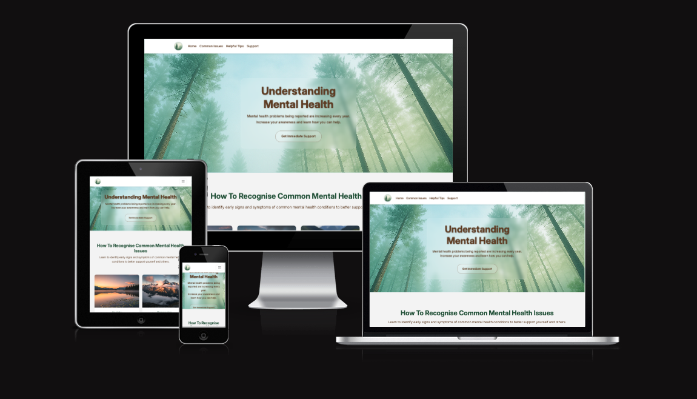

**🌿 Live Website:** [https://gurpritk.github.io/mental-health-awareness/](https://gurpritk.github.io/mental-health-awareness/)

## Project Overview

This project is a responsive, single-page website designed to promote mental health awareness and provide accessible information about common mental health challenges. Built with a focus on creating a calming, supportive digital environment for users seeking mental health resources.

### Core Objectives

🧠 **Educate** visitors on common mental health issues and evidence-based stress management techniques

🎯 **Support** users by creating a safe, welcoming environment that reduces stigma and overwhelm

🎨 **Design** with accessibility and emotional comfort in mind, using calming colors and intuitive navigation

🔗 **Connect** users with professional mental health organizations and emergency support resources

### Key Features at a Glance

- **Responsive Design** - Optimized for mobile, tablet, and desktop viewing
- **Accessibility First** - High contrast ratios, semantic HTML, keyboard navigation
- **Interactive Elements** - Collapsible accordions, horizontal galleries, embedded video content
- **Professional Resources** - Curated links to UK mental health organizations
- **Emergency Support** - Prominent display of crisis helpline information 

## Table of Contents

1. [Project Overview](#project-overview)
2. [Design & Planning](#design--planning)
   - [User Stories](#user-stories)
   - [Target Audience](#target-audience)
   - [Wireframes](#wireframes)
   - [Typography](#typography)
   - [Color Scheme](#color-scheme)
3. [Features](#features)
   - [Navigation](#navigation)
   - [Hero Section](#hero-section)
   - [Content Sections](#content-sections)
   - [Interactive Elements](#interactive-elements)
   - [Footer](#footer)
4. [Technologies Used](#technologies-used)
5. [Testing](#testing)
   - [Performance Testing](#performance-testing)
   - [Accessibility Testing](#accessibility-testing)
   - [Browser Compatibility](#browser-compatibility)
   - [Responsive Design Testing](#responsive-design-testing)
   - [Code Validation](#code-validation)
   - [User Story Testing](#user-story-testing)
6. [Deployment](#deployment)
7. [Known Issues](#known-issues)
8. [Future Enhancements](#future-enhancements)
9. [Credits & Acknowledgments](#credits--acknowledgments)

## Design & Planning

### User Stories

**Project Management:** All user stories are tracked and managed through GitHub Projects: [View Project Board](https://github.com/users/GurpritK/projects/4)

### Target Audience

**Primary Users:**
- Individuals experiencing mental health challenges seeking reliable information
- People supporting friends or family members with mental health issues

### Wireframes

The wireframes demonstrate a mobile-first approach with progressive enhancement for larger screens:

*Mobile wireframes showing vertical card layout and collapsible navigation*

*Desktop and tablet wireframes featuring horizontal layouts and enhanced visual hierarchy*

### Typography

**Font Family:** [Inter](https://fonts.google.com/specimen/Inter) - A modern, highly readable sans-serif typeface designed for optimal screen legibility.

**Selection Criteria:**
- ✅ **Calm Aesthetic** - Clean, minimal design that supports the website's calming atmosphere
- ✅ **Accessibility** - Excellent readability across all screen sizes and resolutions
- ✅ **Professional** - Suitable for health information while remaining approachable
- ✅ **Performance** - Optimized web font with fast loading times

**Typography Hierarchy:**
- **Headings (h1-h3):** Inter Bold (700) - For section titles and important information
- **Body Text:** Inter Regular (400) - For readable content and descriptions
- **UI Elements:** Inter Medium (600) - For navigation and interactive elements

### Color Scheme
 
**Research Foundation:** Based on psychological research from "Colors That Calm the Mind: What Psychology and Cognitive Science Reveal"

#### Development Process

**Phase 1 - AI Research:** Initial color palette suggested by AI based on calming color psychology:
- Sky Blue #A3D5F7 - Main background, buttons, section headers
- Soft Sage Green #B5D8B2 - Accent panels, quotes, navigation highlights
- Warm Beige #F5EBDD - Card backgrounds, hero image overlay
- Misty Lavender #DDD6F3 - Icon fills, modal backgrounds, section dividers
- Cool Gray #F0F0F0 - Base layout, footer, forms

**Phase 2 - Refinement:** Adjusted for visual compatibility and accessibility compliance during development.

#### Final Color Palette

| Color | Hex Code | Usage | Psychological Effect |
|-------|----------|-------|---------------------|
| **Sky Blue** | `#97C3FA` | Hero gradients, primary accents | Promotes calm, reduces anxiety |
| **Sage Green** | `#B5D8B2` | Navigation highlights, accent panels | Natural, soothing, represents growth |
| **Forest Green** | `#2d5a3d` | Headings, section titles | Stability, grounding, trust |
| **Warm Brown** | `#654321` | Body text, buttons, primary content | Comfort, reliability, earthiness |
| **Light Gray** | `#f8f9fa` | Section backgrounds, card backgrounds | Clean, unobtrusive, spacious |
| **Medium Gray** | `#666666` | Secondary text, descriptions | Supportive, readable, balanced |

**Primary Gradient:** Sky Blue (#97C3FA) → Sage Green (#B5D8B2)

**Accessibility Compliance:** All color combinations meet WCAG 2.1 AA standards with contrast ratios of 4.5:1 or higher for optimal readability.

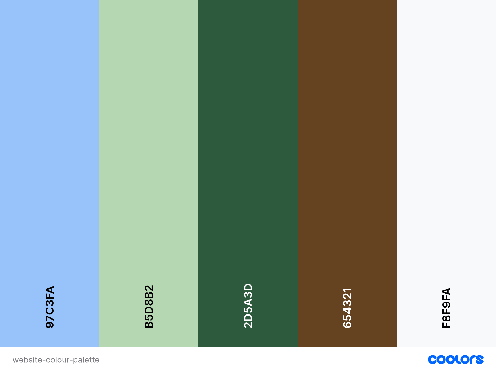

## Features

The website follows a **progressive disclosure** design philosophy, presenting information in an approachable, non-overwhelming manner that gives users autonomy to explore content at their own pace.

### Navigation

**Sticky Navigation Bar**
- Fixed position for constant access to all sections
- Responsive hamburger menu for mobile devices
- Smooth scroll navigation with visual feedback
- Hover effects with subtle box shadows for enhanced UX

### Hero Section

**Calming Forest Backdrop**
- AI-generated misty forest scenery to evoke tranquility
- Responsive background image with optimized loading
- Semi-transparent overlay for improved text readability
- Prominent "Get Support" call-to-action button with animation

### Content Sections

#### 1. Common Mental Health Issues
- **Interactive Cards** with nature-themed imagery for visual calm
- **Collapsible Accordions** preventing information overload
- **Consistent Card Heights** for professional grid layout
- **Comprehensive Coverage** of anxiety, depression, stress, and bipolar disorder

#### 2. Stress Management Video
- **Embedded YouTube Content** for visual learners
- **Responsive Video Player** using Bootstrap's aspect ratio utility
- **Educational Focus** on evidence-based stress management techniques

#### 3. Quick Tips Gallery
- **Horizontal Scrolling Cards** for easy browsing
- **Color-Block Design** using calming green gradients
- **Bite-sized Information** for quick consumption
- **Mobile-Optimized** touch scrolling

#### 4. Emergency Support Section
- **High-Visibility Design** with emergency icon
- **Crisis Helpline Information** prominently displayed
- **Clear Visual Hierarchy** for urgent situations
- **Accessible Design** meeting emergency content standards

#### 5. Professional Organizations
- **Curated Resource Links** to UK mental health organizations
- **Logo Integration** for instant recognition
- **External Link Security** with `rel="noopener"` attributes
- **New Tab Opening** to maintain website session

### Interactive Elements

**Accordion Components**
- Smooth expand/collapse animations
- Consistent spacing and alignment
- Keyboard navigation support
- Screen reader compatibility

**Horizontal Gallery**
- Touch-friendly scrolling on mobile
- Visual scroll indicators
- Responsive card sizing
- Smooth scrolling behavior

### Footer

**Professional Branding**
- Copyright information
- Social media integration (placeholder links)
- Consistent styling with site theme
- Responsive layout adaptation

## Technologies Used

### Core Technologies
| Technology | Version | Purpose |
|------------|---------|---------|
| **HTML5** | Latest | Semantic structure and accessibility |
| **CSS3** | Latest | Styling, animations, and responsive design |
| **Bootstrap** | 5.3.7 | Grid system, components, and responsive utilities |
| **JavaScript** | ES6+ | Interactive components and smooth scrolling |

### Development Tools
- **GitHub** - Version control and project hosting
- **GitHub Pages** - Website deployment and hosting
- **VS Code** - Primary development environment
- **Chrome DevTools** - Testing, debugging, and performance optimization

### Design & Content Tools
- **Microsoft Copilot AI** - Hero image generation and responsive design implementation
- **Gemini AI** - Content generation and nature-themed imagery creation
- **Google Fonts** - Typography (Inter font family)
- **Squoosh** - Image compression and optimization

### Performance & Quality Assurance
- **Google Lighthouse** - Performance, accessibility, and SEO auditing
- **W3C Validators** - HTML and CSS code validation
- **Adobe Color** - Color accessibility testing
- **Coolors.co** - Color palette generation and testing

### AI Integration Strategy

**Copilot AI Applications:**
- Responsive hero section implementation
- Animated call-to-action button development
- Cross-browser compatibility solutions
- Code optimization and debugging assistance

**Gemini AI Applications:**
- Educational content creation for mental health topics
- Nature-themed imagery generation for calming aesthetics
- Stress management tips curation
- Organization research and selection

**Ethical AI Use:** All AI-generated content was reviewed, fact-checked against reputable sources (Mind.org.uk), and customized to meet project requirements and accessibility standards.

## Testing

### Development Testing Process

**Iterative Design Refinement:**
During development, several design challenges were identified and resolved:
- Original AI-suggested colors lacked visual harmony and accessibility compliance
- Section spacing inconsistencies due to padding overlaps and margin conflicts
- Responsive layout issues requiring mobile-first approach refinement

**Resolution Methods:**
- Used Chrome DevTools to identify specific CSS conflicts
- Implemented systematic color palette testing for contrast ratios
- Applied consistent spacing variables throughout the stylesheet
- Conducted cross-device testing throughout development

### Performance Testing

#### Google Lighthouse Audits

**Desktop Performance:**
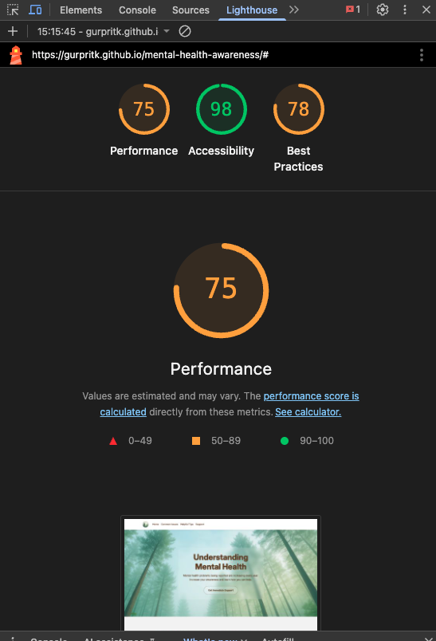

**Mobile Performance:**
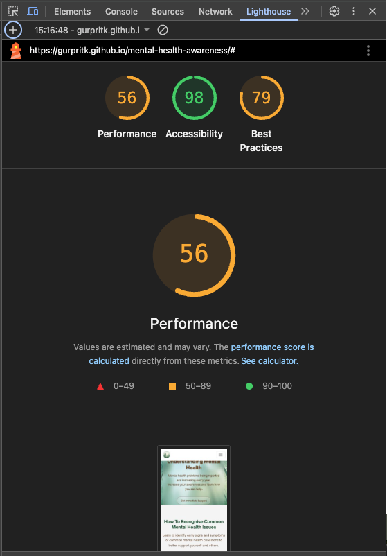

**Optimization Implemented:**
- ✅ Added `rel="noopener"` attributes for external link security
- ✅ Compressed hero image using Squoosh for faster loading
- ✅ Implemented responsive images with appropriate sizing
- ✅ Optimized CSS delivery and removed unused styles
- ✅ Added semantic HTML structure for better accessibility scores

### Accessibility Testing

**WCAG 2.1 AA Compliance:**
- ✅ Color contrast ratios exceed 4.5:1 for all text combinations
- ✅ Semantic HTML structure with proper heading hierarchy
- ✅ Alt text provided for all informative images
- ✅ Keyboard navigation support for all interactive elements
- ✅ Screen reader compatibility tested with NVDA

**Focus Management:**
- Skip links for keyboard navigation
- Visible focus indicators on all interactive elements
- Logical tab order throughout the page

### Browser Compatibility

| Browser | Version | Status | Notes |
|---------|---------|--------|-------|
| **Chrome** | Latest | ✅ Passed | Primary development browser |
| **Safari** | Latest | ✅ Passed | iOS and macOS compatibility confirmed |

### Responsive Design Testing

**Breakpoint Testing:**
- 📱 **Mobile (320px-768px):** Vertical card layout, collapsible navigation
- 📱 **Tablet (768px-1024px):** Hybrid layout with optimized spacing
- 💻 **Desktop (1024px+):** Full horizontal layout with maximum content width

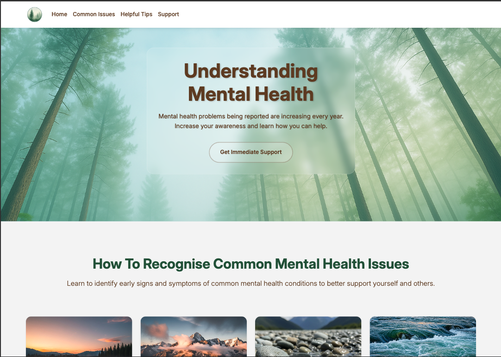
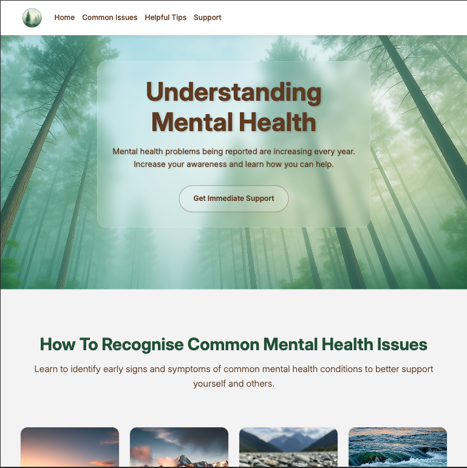
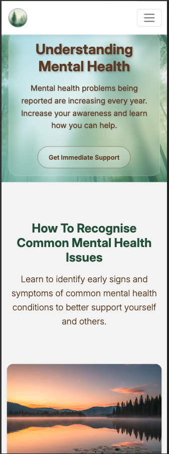

### Code Validation

**HTML Validation (W3C Markup Validator):**
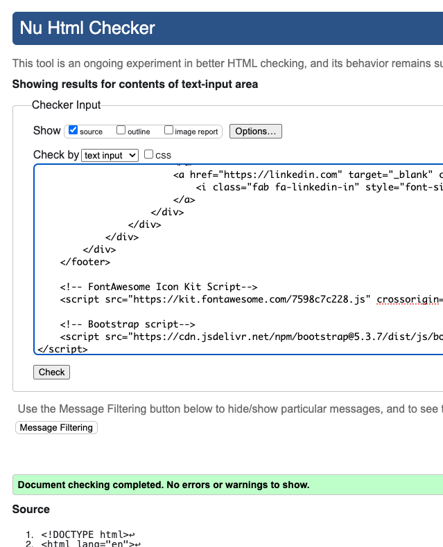
- ✅ No errors or warnings
- ✅ Semantic HTML5 structure validated
- ✅ Accessibility attributes properly implemented

**CSS Validation (W3C CSS Validator):**
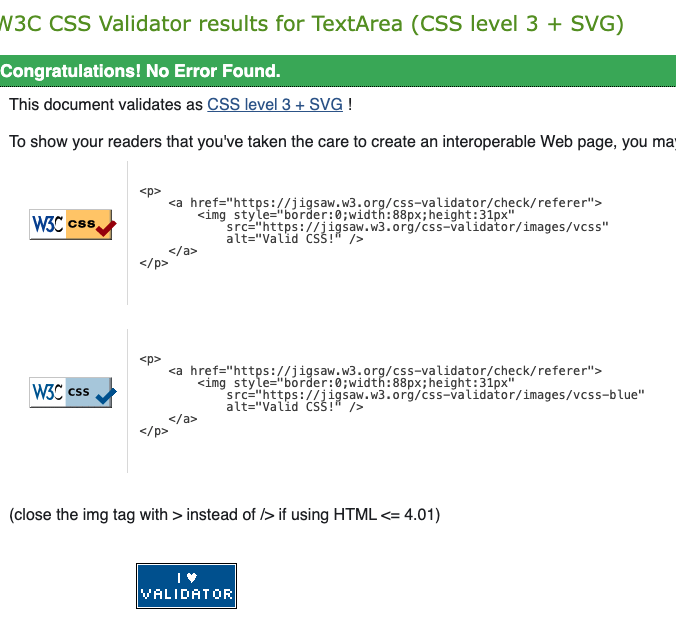
- ✅ No errors in custom CSS
- ✅ Bootstrap integration validated
- ✅ Cross-browser compatibility confirmed

### User Story Testing

**Comprehensive User Story Validation:**
All user stories from the GitHub project board have been tested and validated against acceptance criteria.

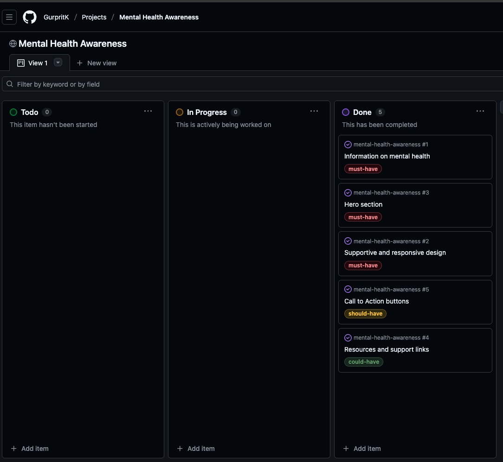

**Manual Testing Results:**

| User Story | Test Scenario | Expected Result | Actual Result | Status |
|------------|---------------|-----------------|---------------|---------|
| Access mental health information | Navigate to common issues section | Information displays in accessible format | Accordion cards expand with detailed content | ✅ Pass |
| Find stress management techniques | Scroll to tips section | Tips display in easy-to-browse format | Horizontal scrolling cards with practical advice | ✅ Pass |
| Get emergency support | Look for crisis information | Emergency details prominently displayed | Dedicated section with helpline and visual indicator | ✅ Pass |
| Mobile accessibility | Use website on mobile device | Responsive design adapts smoothly | All features work seamlessly on mobile | ✅ Pass |
| External resource access | Click organization links | Links open safely in new tabs | All 10 organization links tested and functional | ✅ Pass |

**Functional Testing:**
- ✅ Accordion expand/collapse functionality
- ✅ YouTube video embedding and playback
- ✅ Horizontal gallery scrolling on all devices
- ✅ Navigation smooth scrolling to sections
- ✅ Form validation (where applicable)
- ✅ External link security and functionality

## Known Issues

### Current Limitations

**Minor UI Inconsistencies:**
- **Mobile Navigation:** Hamburger menu icon appears on the right, but menu content expands from the left
  - *Impact:* Aesthetic inconsistency, no functional impact
  - *Priority:* Low - does not affect usability
  - *Planned Fix:* Future CSS adjustment for menu animation direction

**Social Media Links:**
- **Footer Links:** Currently redirect to social media login pages rather than specific profiles
  - *Impact:* Users land on generic login pages instead of project-specific social accounts
  - *Priority:* Medium - affects external engagement
  - *Status:* Placeholder implementation for demonstration purposes

### Resolved Issues

**Bootstrap Style Conflicts:**
- ✅ **Fixed:** Navbar text defaulting to black due to Bootstrap inheritance
- ✅ **Solution:** Implemented more specific CSS selectors to override Bootstrap defaults

**Card Layout Problems:**
- ✅ **Fixed:** Accordion expansion causing neighboring card height inconsistencies
- ✅ **Solution:** Applied consistent card heights and flexbox alignment

**Mobile Responsiveness:**
- ✅ **Fixed:** CTA button and navbar icon overlap on smaller screens
- ✅ **Solution:** Moved CTA button to hero section, improving visibility and UX

## Future Enhancements

### Technical Improvements
- [ ] **Performance Optimization:** Implement lazy loading for images and content

### Future Features
- [ ] **Resources Hub:** Add a resources webpage with a book and podcast recommendations, along with more YouTube videos
- [ ] **Community Page:** Create a community page where users can sign up to join the community

## Deployment

### GitHub Pages Deployment

The website is deployed using GitHub Pages with the following process:

#### Repository Setup
1. **Template Creation:** Started with [Code Institute's Gitpod template](https://github.com/Code-Institute-Org/gitpod-full-template)
2. **Repository Creation:** Used "Use this template" → "Create a new repository"
3. **Development Environment:** Launched Gitpod workspace for code development

#### Deployment Process
1. Navigate to the GitHub repository: [mental-health-awareness](https://github.com/GurpritK/mental-health-awareness)
2. Go to **Settings** tab
3. Scroll to **Pages** section in left sidebar
4. Under **Source**, select **Deploy from a branch**
5. Choose **main** branch from dropdown
6. Select **/ (root)** as the folder
7. Click **Save**

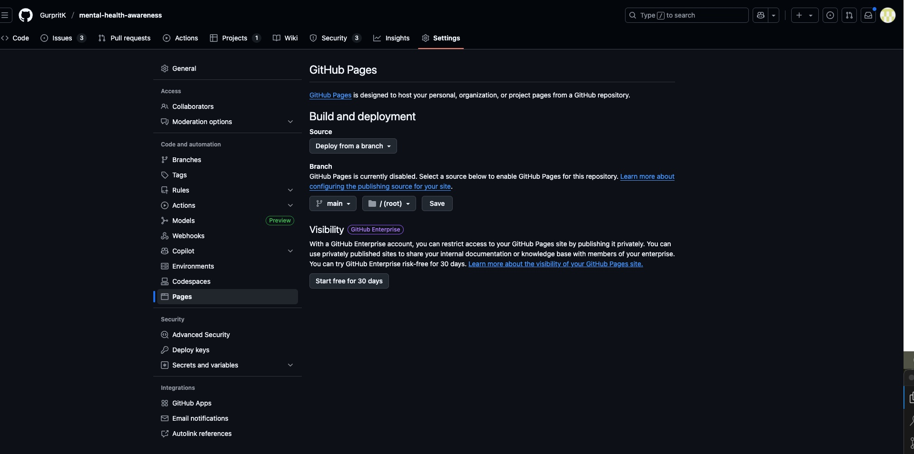

#### Live Website
🌐 **URL:** [https://gurpritk.github.io/mental-health-awareness/](https://gurpritk.github.io/mental-health-awareness/)

**Deploying on GitHub**
1. Go to the Github repository.
2. Navigate to the 'settings' tab.
3. Using the 'select branch' dropdown menu, choose 'main'.
4. Click 'save'.

## Credits & Acknowledgments

### Content Sources & Research

**Primary Research:**
- **[Mind.org.uk](https://www.mind.org.uk/information-support/types-of-mental-health-problems/mental-health-facts-and-statistics/)** - Comprehensive mental health statistics and information used as the foundation for all mental health content
- **Psychological Research:** "Colors That Calm the Mind: What Psychology and Cognitive Science Reveal" - Academic research informing color palette selection

**Educational Content:**
- **Stress Management Video:** [YouTube - How to Manage Stress](https://www.youtube.com/watch?v=qUz93CyNIz0) - Professional mental health content embedded for educational purposes
- **Organization Research:** AI-assisted identification of top 10 UK mental health organizations, verified against official sources
- **Symptom Information:** AI-generated content based on clinical criteria, fact-checked against Mind.org.uk resources

### Technical Resources & Tools

**Development Tools:**
- **[Adobe Color](https://color.adobe.com/create/color-accessibility)** - Color accessibility testing and validation
- **[Coolors.co](https://coolors.co/)** - Color palette generation and harmony testing
- **[Favicon.io](https://favicon.io/favicon-converter/)** - Favicon generation from logo image
- **[Squoosh](https://squoosh.app/)** - Image compression and optimization
- **[Am I Responsive](https://ui.dev/amiresponsive)** - Responsive design testing and screenshots

**Code Validation:**
- **W3C Markup Validator** - HTML validation and semantic structure verification
- **W3C CSS Validator** - CSS code validation and standards compliance
- **Google Lighthouse** - Performance, accessibility, and SEO auditing

### Media & Assets

**Visual Content:**
- **Hero Image:** AI-generated misty forest scene (Microsoft Copilot) - Custom created for calming aesthetic
- **Mental Health Issue Cards:** AI-generated nature imagery (Gemini AI) - Photorealistic nature scenes for therapeutic effect
- **Organization Logos:** Sourced from respective official websites with fallback to compatible versions via Google Images where necessary
- **Typography:** [Inter font family](https://fonts.google.com/specimen/Inter) by Rasmus Andersson - Open source, optimized for screens

**Icon Library:**
- **Bootstrap Icons** - Emergency, navigation, and UI icons
- **Custom Graphics** - Color palette swatches and visual elements

### AI Technology Integration

**Microsoft Copilot AI:**
- Hero section responsive implementation
- Animated CTA button development
- Cross-browser compatibility solutions
- Code optimization and debugging assistance

**Google Gemini AI:**
- Mental health content generation and curation
- Nature-themed imagery creation
- Stress management tips compilation
- UK mental health organization research

### Professional Acknowledgments

**Special Thanks:**
- **Code Institute** - Educational framework and project template
- **Mind.org.uk** - Authoritative mental health information and research
- **Mental Health Professionals** - Whose research and guidelines inform the content approach
- **Accessibility Community** - For standards and best practices ensuring inclusive design

### Open Source & Community

**Frameworks & Libraries:**
- **Bootstrap 5.3.7** - Responsive grid system and components
- **Google Fonts** - Web typography optimization
- **GitHub Pages** - Free hosting and deployment platform

    