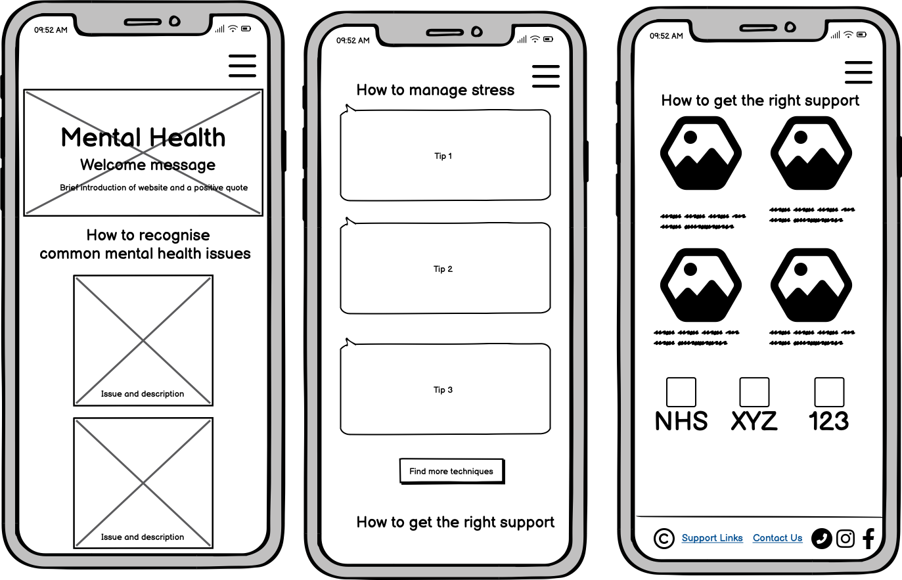
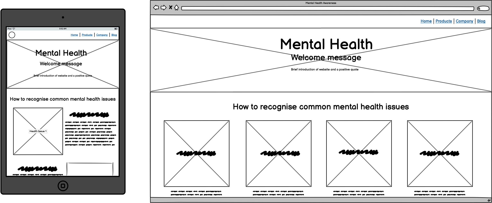
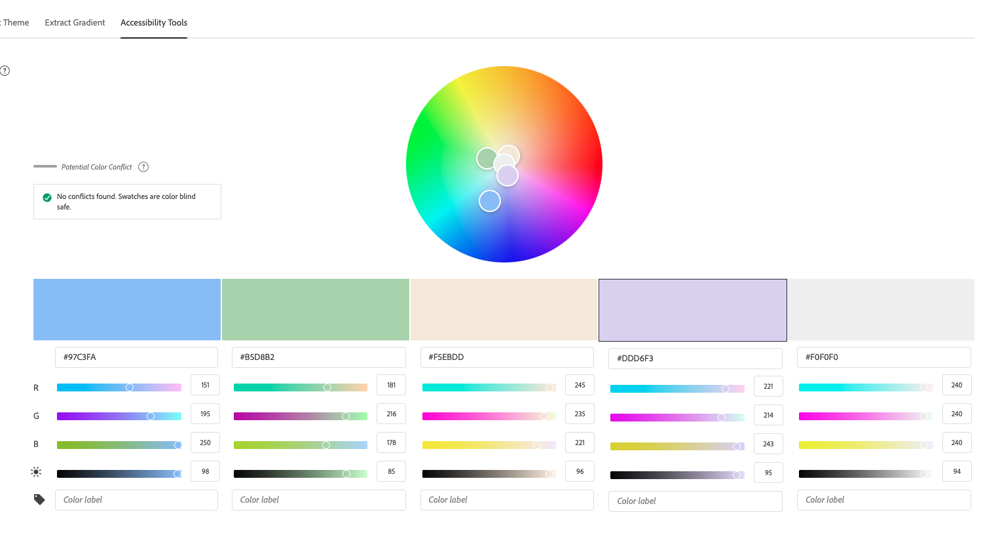

# mental-health-awareness

## Table Of Contents:
1. [Design & Planning](#design-&-planning)
    * [User Stories](#user-stories)
    * [Wireframes](#wireframes)
    * [Typography](#typography)
    * [Colour Scheme](#colour-scheme)

    
2. [Features](#features)
    * [Navigation](#Navigation)
    * [Footer](#Footer)
    * [Home page](#Home-page)
    * [Other features](#Other-features)

3. [Technologies Used](#technologies-used)
4. [Testing](#testing)
5. [Bugs](#bugs)
6. [Deployment](#deployment)
7. [Credits](#credits)

## Design & Planning:

https://ui.dev/amiresponsive - add website here once deployed to get a screenshot.

### Main Purpose of Website
The core purpose of this website is to promote mental health awareness by providing easy-to-understand, beginner-friendly information in a calm, supportive, and well-organised online space. It aims to:

🧠 Educate visitors on common mental health issues and stress management techniques

🎯 Create a safe, welcoming environment where users feel supported and not overwhelmed

🎨 Present content in a clean, calming design, using HTML, CSS, and Bootstrap to enhance accessibility and emotional comfort

#### Target Audiences Identified 

1. Individuals Seeking Mental Health Information
2. Students and Young Adults
3. Caregivers and Family Members
4. General Public and Community Members

### User Stories

User stories shown in Github project: https://github.com/users/GurpritK/projects/4 

### Wireframes

### Typography

I looked for fonts with a calm characteristic, and a minimal, simple design. Anythign too cursive felt busy, and didn't fit the design aesthetic of calm, minimal and clean that I'm looking to implement. I used AI prompts for google fonts to fit this description, and decided on using the **Inter** font.

### Colour Scheme
 
Colors That Calm the Mind: What Psychology and Cognitive Science Reveal: https://blog.cognifit.com/colors-that-calm-the-mind-what-psychology-and-cognitive-science-reveal/

- Used AI to find a colour palette with the calming colours identified from the article:
    - Sky Blue #A3D5F7 - Main background, buttons, section headers
    -  Soft Sage Green	#B5D8B2	- Accent panels, quotes, navigation highlights
    - Warm Beige	#F5EBDD- Card backgrounds, hero image overlay
    - Misty Lavender	#DDD6F3- Icon fills, modal backgrounds, section dividers
    - Cool Gray	#F0F0F0- Base layout, footer, forms

- Adjusted suggested sky blue to a slightly different shade for better compatibility

https://color.adobe.com/create/color-accessibility 

## Features:
Explain your features on the website,(navigation, pages, links, forms.....)

Information available is provided in an approachable, welcoming manner with designs where  users have autonomy to click through the different features of the website and get the information they are interested in. I have chosen this approach where information is concealed so that the volume of information is not overwhelming and overcrowd the website, but it's obvious where to go to find the information desired.

- 'Get Support' button shown at the beginning of the page, floating into view, prompting users attention to the CTA. The button leads to the 'support' section of the website, so users can immediately find the support they require.
- 'Common Symptoms' dropdown menu which shows the symptoms associated with each common mental health problem. Showcasing this data within a dropdown meant that the website was not overcroweded with information, and users can click on the symptoms they are interested to learn about.
- Embedded YouTube link on 'How to manange stress' found within the corresponding section to offer information in a different format for visual learners. Users can click on the video directly within the website page. I decided to include a video to increase the variety of ways to consume information to appeal to different users. 
- Quick tips to manage stress displayed on cards on a horizontal slidebar for interested users to slide through.
- It was important to display instructions for emergency situations in a clear and direct format. Therefore, I displayed this information in it's own display box, with an icon for emergency sirens to draw the users attention.
- Links to other mental health organisations are displayed at the end of the page, these links open in a new tab. These links have been designed so that they are eye-catching, and encourage the user to click on them as they are logos of the organisations overlayed on a white display box, and shadows underneath the box (like a button).

### Navigation
### Footer
### Other features
## Technologies Used
List of technologies used for your project...
HTML
CSS
Bootstrap
Github

### AI Use
Used Copilot AI to implement my hero image and make it responsive across different screens, with an animated moving 'immediate support' button to bring attention to this CTA. Generated my hero image on Microsoft Copilot.

Used Gemini AI to create my images for 'common mental health issues', focussing on creating nature photorealistic images to evoke calmness, and have a consistent nature theme throughout the page. Found Gemini AI was more effective at creating images in comparison to Microsoft.

## Testing
Important part of your README!!!

When creating the website, I did not find the colours visually compatabile despite the AI recommendations, and make changes to the colour palette as I worked through it. The main colour palette evolved to: 

Website's color palette: (#97C3FA, #B5D8B2, #654321).

### Google's Lighthouse Performance
Screenshots of certain pages and scores (mobile and desktop)

Initial tests showed 75 for Performance, 98 for Accessibility and 57 for Best Practices. A deeper dive revealed performance issues with the hero image load.

The attribute rel="noopener" for added security on external links was missing, so these were applied.

### Browser Compatibility
Check compatability with different browsers
### Responsiveness
Screenshots of the responsivness, pick few devices (from 320px top 1200px)
### Code Validation
Validate your code HTML, CSS (all pages/files need to be validated!!!), display screenshots
### Manual Testing user stories or/and features
Test all your user stories, you an create table 
User Story |  Test | Pass
--- | --- | :---:
paste here you user story | what is visible to the user and what action they should perform | &check;
- and attach screenshot

## Bugs
List of bugs and how did you fix them
Navbar font set to black by default by inheriting bootstrap properties. Created more specific styling to target this, and change to brown. 

Issues with the dropdown for 'common symptoms' - when I opened up one dropdown, it would increase the spacing in the cards of the neighbouring cards. Used Copilot to identify the cause:
"Problems Identified:
Inconsistent Card Heights: When one accordion expanded, it made that card taller, shifting other cards"

Get Support CTA button and navbar icon positioning overlaps on smaller screens when both were included in the navbar. I moved the Support CTA button to the hero section instead, and this made it more eye-catching too.

Navbar burger icon opens up menu text on the left hand side of page for smaller screens, but the icon sits on the right.

## Deployment

#### Creating Repository on GitHub
- First make sure you are signed into [Github](https://github.com/) and go to the code institutes template, which can be found [here](https://github.com/Code-Institute-Org/gitpod-full-template).
- Then click on **use this template** and select **Create a new repository** from the drop-down. Enter the name for the repository and click **Create repository from template**.
- Once the repository was created, I clicked the green **gitpod** button to create a workspace in gitpod so that I could write the code for the site.
#### Deloying on Github
The site was deployed to Github Pages using the following method:
- Go to the Github repository.
- Navigate to the 'settings' tab.
- Using the 'select branch' dropdown menu, choose 'main'.
- Click 'save'.

## Credits
List of used resources for your website (text, images, snippets of code, projects....)
  - Code & Text Content

  https://www.mind.org.uk/information-support/types-of-mental-health-problems/mental-health-facts-and-statistics/ 
  https://www.youtube.com/watch?v=qUz93CyNIz0 

  https://favicon.io/favicon-converter/ to generate the favicon from the logo image 

  
  - Media

  Logos for mental health organisations taken from their respective sites. In cases where the logo from the sites were not compatible with my website, more compatible logos were found using Google Images.
  
  - Acknowledgment
    